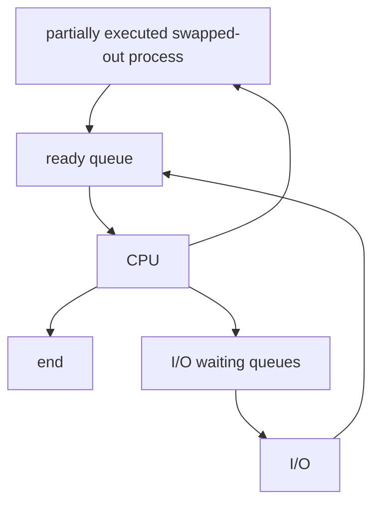

# Process Scheduling

- scheduler maintains scheduling queues of processes:
    - job queue: set of all processes in the system.
    - ready queue: set of all processes residing in main memory and are ready and waiting to exec. this can be stored as a linkedlist of the different PCBs of different processes.
    - device queues: set of processes waiting for an I/O device.

## Scheduler

### CPU scheduler aka short term scheduler
- scheduler makes the decision who should be run next, and the dispatcher makes the actual switch from waiting to running by allocating the CPU to the process selected by the scheduler.
- invoked very frequently (milliseconds) => must be very fast

### Job scheduler aka long term scheduler
- selects which processes from job queue should be brought into the ready queue.
- invoked infrequently (sec, minutes) => may be slow
- controls degree of multiprogramming (number of process in main memory)

### Medium term scheduler
- can be added in time sharing system is degree of multiprogramming needs to decrease.
- swapped out processes are stored in a space called the swap space in the secondary storage and this is different from the ready queue.

